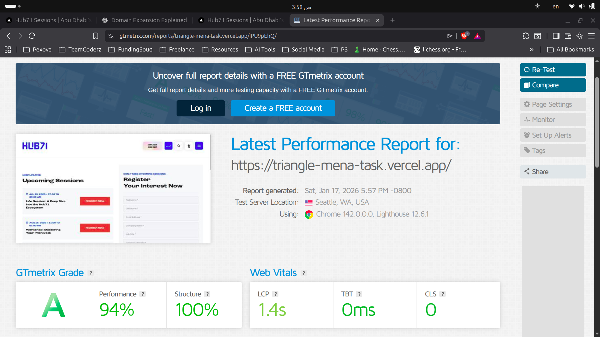

# Hub71 Sessions

A responsive, multilingual (EN/AR) registration page for Hub71 Info Sessions, featuring upcoming and previous session listings with a registration form.

**Live Demo:** [https://triangle-mena-task.vercel.app](https://triangle-mena-task.vercel.app)

## Tech Stack

- **Framework:** Next.js 16.1.2 (App Router)
- **Language:** TypeScript
- **Styling:** Tailwind CSS 4
- **Animations:** Framer Motion
- **Validation:** Zod
- **Icons:** React Icons
- **i18n:** Custom context-based solution (EN/AR with RTL support)

## Getting Started

### Prerequisites

- Node.js 18+
- npm, yarn, pnpm, or bun

### Installation

```bash
# Clone the repository
git clone <repository-url>
cd triangle-mena-task

# Install dependencies
npm install
```

### Environment Variables

Create a `.env.local` file in the root directory:

```env
NEXT_PUBLIC_API_BASE_URL=https://api.example.com
NEXT_PUBLIC_SITE_URL=https://triangle-mena-task.vercel.app
```

### Run Development Server

```bash
npm run dev
```

Open [http://localhost:3000](http://localhost:3000) in your browser.

## Build & Production

```bash
# Build for production
npm run build

# Start production server
npm run start

# Lint the codebase
npm run lint
```

## Performance


